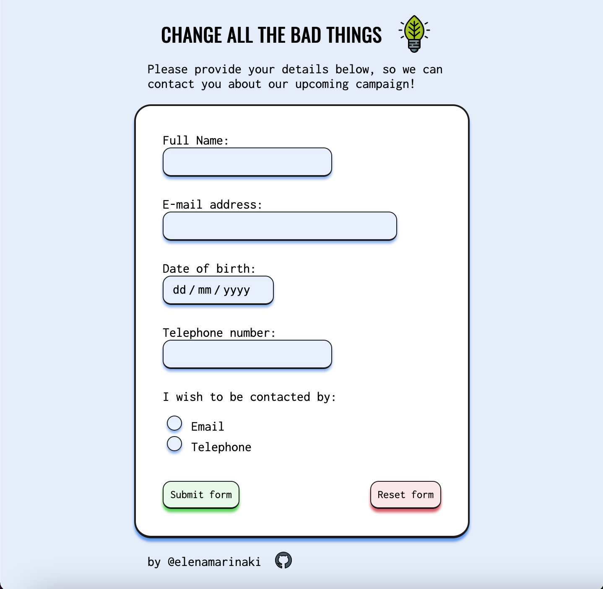
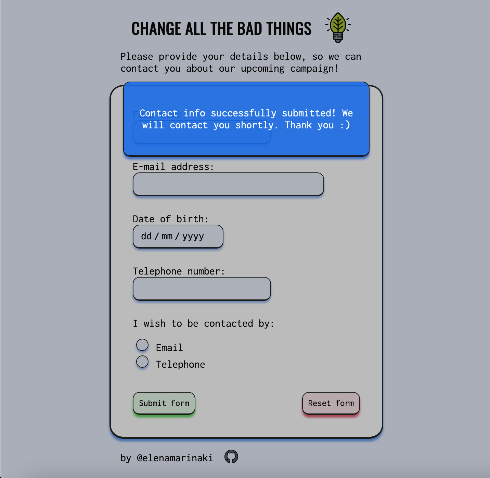

# Data Collection Form

## Change All The Bad Things
🌱 🌱 🌱 🌱 🌱 🌱 🌱 🌱 🌱 🌱 🌱 🌱 🌱 🌱 🌱 🌱 🌱 🌱

### Base Functionality :page_with_curl:

- The form collects name, email address, date of birth and telephone number.
- It gives the option to the user to choose how they wish to be contacted, email or telephone.
- All input fields need to be validated before submitting.
  - The fields are turning into _red_ when invalid type of data is being given.
- The details are stored in a _Firebase_ Database through the `submit` button.
- The `reset` button clears all fields.

### Recent Updates 💡

- The form gives the option to the user to choose how they wish to be contacted, email or telephone.
- Telephone number validation has been improved, and only UK numbers are accepted.
- After successful submission, all input fields are cleared and a modal appears on page. The user can close the modal by clicking anywhere on the background faded are and return to the form. 

### Coming next ... :test_tube:

- Optimized for desktop (as currently is mobile first approach)

