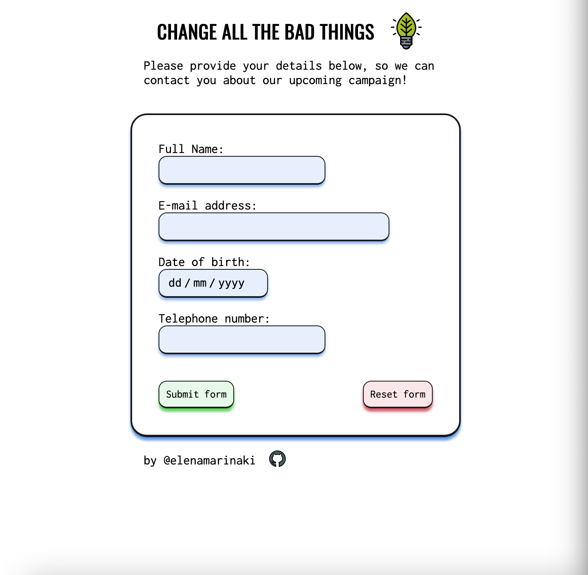

# Data Collection Form

## Change All The Bad Things

### Base Functionality 

- The form collects name, email address, date of birth and telephone number.
- All input fields need to be validated before submitting.
  - The fields are turning into _red_ when invalid type of data is being given.
- The details are stored in a _Firebase_ Database through the `submit` button.
- The `reset` button clears all fields.

### Coming next ... :test_tube:

- Option to be contacted either by phone or email.
- Optimized for desktop (as currently is mobile first approach)
- Improve the telephone number validation
- Better visual handling after submitting the form and reset of all fields.

